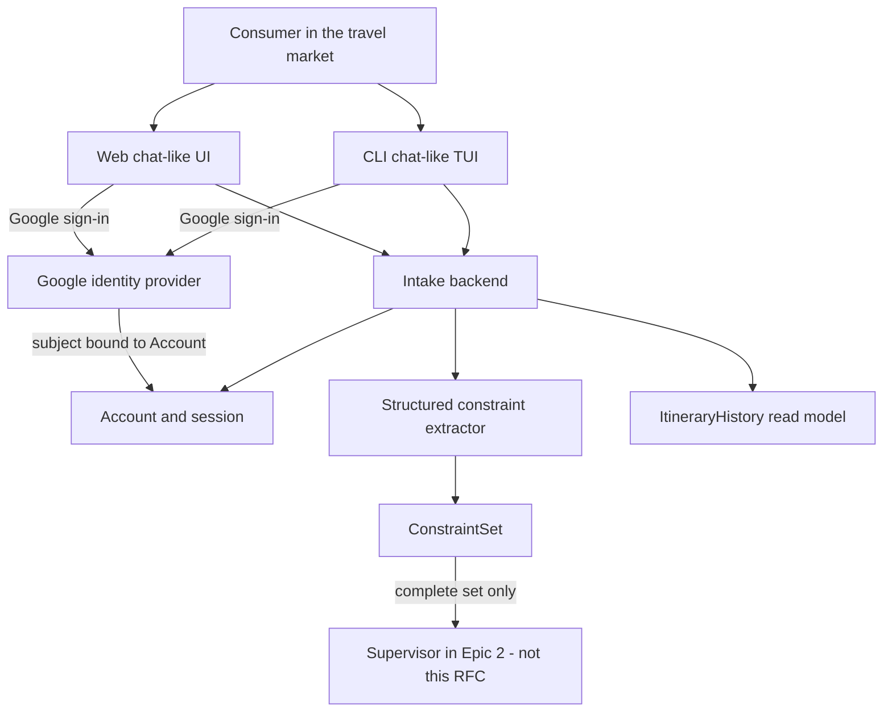

# RFC-0001: Epic 1 intake architecture

## Metadata

| Field | Value |
| --- | --- |
| Status | Draft |
| Authors | `sdlc-rfc-drafter` (engineering) |
| Reviewers wanted | Product Owner (**mjbvilhena**); orchestration layer; travel domain (`leisure orchestrator`) |
| Last updated | 2026-09-20 |
| Related | `docs/product/specification.md` (Epic 1; Core Workflows §1, §4); `docs/product/user-stories/epic-1/` (US-E1-01 through US-E1-07, approved by **mjbvilhena** 2026-09-20); `DOMAIN.md`; `LAYER.md`; `docs/product/backlog.md` Tasks 1.2–1.3. Sibling drafts in this band (still **Draft**, not approval): [`api-design-epic-1-intake.md`](api-design-epic-1-intake.md), [`api-contract-epic-1-intake.md`](api-contract-epic-1-intake.md), [`ux-epic-1-intake.md`](ux-epic-1-intake.md), [`test-plan-epic-1-intake.md`](test-plan-epic-1-intake.md), [`e2e-test-plan-epic-1-intake.md`](e2e-test-plan-epic-1-intake.md), [`threat-model-epic-1-intake.md`](threat-model-epic-1-intake.md). Google sign-in and per-account history cross a trust boundary — residual risk is not accepted in the threat-model draft. |

This RFC is **not** approved. Drafted files are not technical-design approval. Decision is blank until named human sign-off or an explicit “treat as approved” sentence.

## Objective

If this RFC is accepted, implementers have one concrete system shape for **Epic 1 — Natural-language intake of trip constraints** before first application code:

- Consumers in the travel market authenticate with **Google** on the **web** and **CLI** chat-like surfaces and work as signed-in account holders (US-E1-01).
- They submit a **natural-language** trip prompt as primary intake — not a multi-field form, not API-only B2C (US-E1-02).
- Intake produces a **structured, machine-usable constraint set** for the Supervisor (US-E1-03), including required **party size** (ask if missing; US-E1-04), a **1–5 scoring matrix** captured with all required dimensions visible together (US-E1-05), and **any destination** the tools can reach without an Epic 1 city allowlist (US-E1-06).
- A signed-in consumer can **retrieve itinerary history** for their own account, including an empty history (US-E1-07).

**Why now:** Epic 1 story artefacts are approved. The pipeline’s next legal band is design/planning. Several technical choices the specification marks **unset** (auth protocol, SDK, session store, constraint serialization) must be proposed here so later API, UX, and threat-model artefacts share one shape.

**Cost of doing nothing:** first application code would invent those unset choices in a pull request. Web and CLI would drift. The Supervisor (Epic 2) would not have a stable constraint set to consume. History isolation (US-E1-07 AC2) would have no agreed identity.

## Scope

### In scope

- Architecture and data flow for Epic 1 only: Google sign-in on web and CLI, chat-like intake, constraint-set assembly, completeness gate, scoring-matrix capture **pattern** (web widget; CLI TUI widget), per-account history **read** path.
- A first-party backend that both surfaces call. That backend is an engineering surface, not a consumer product channel (API-only B2C remains out of scope).
- Named constraint fields only: budget, dates, destination, preferences, party size, scoring matrix (at least price, duration, stops).
- Persistence identity: an application **Account** associated with the Google-authenticated consumer; history is keyed by that account.

### Out of scope (and which doc will cover it)

- Field-level HTTP/RPC paths, status tables, and JSON schemas — `sdlc-api-designer` (`api design` + `api contract`), after this RFC is reviewable.
- Wireframes, copy, and widget placement relative to the prompt — `sdlc-ux-designer` (`ux design`). This RFC must not pick a pixel layout. US-E1-05 forbids inventing whether the scoring widget appears before, during, or after the prompt.
- Test strategy and journey scripts — `sdlc-test-planner` (`test_plan`, `e2e_test_plan`).
- STRIDE/threat model for Google sign-in and history isolation — `sdlc-threat-modeler` (`threat_model`).
- Accepted decision record — `sdlc-adr-drafter` only after this RFC concludes.
- Epic 2: Supervisor / specialist spawning, curated KB, live-web fallback, applying the scoring matrix to search.
- Epic 3: remaining-budget handoff, rebalance, fail-closed overflow.
- Epic 4: producing a coordinated itinerary, deep links, charged booking. Epic 1 **retrieves** history; **writing** a coordinated itinerary is Epic 4. This RFC still proposes that the history store exist so the read path is real.

### Non-goals

- Password reset, generic SSO/SAML, social login other than Google, guest/anonymous intake, multi-user trip workspaces, sharing.
- A multi-field form as primary intake; a destination-picker as primary intake; an API-only consumer product.
- Extra required constraint fields (cabin class, rooms, adult/child split, extra scoring dimensions, origin-vs-destination policy, currency policy).
- Invented vendors for KBs, payments, or identity other than Google.
- Quantitative KPIs or SLOs (the specification does not state them).
- UI pixel details (colors, spacing, control look, widget/TUI library).

## Current state

Evidence from the open workspace (2026-09-20):

- Product vision: `docs/product/vision.md`.
- Product specification and MVP epics: `docs/product/specification.md`. Spec and epics approved by **mjbvilhena** (2026-09-15, PR #1).
- Epic 1 stories US-E1-01 through US-E1-07: `docs/product/user-stories/epic-1/`. Story artefacts approved by **mjbvilhena** (2026-09-20). Story-artefact approval is not implementation Done.
- Domain/layer seeds: `DOMAIN.md` (travel; consultant name `leisure orchestrator`), `LAYER.md` (orchestration).
- CI: `.github/workflows/qa.yml` (secret scan, markdown lint, workflow lint). `CODEOWNERS` assigns `@mjbvilhena`.
- **No application source tree, test suite, or runtime** (2026-09-20 workspace evidence; still true on 2026-09-22 re-audit). Sibling design/planning drafts now exist under `docs/technical_design/` in this same band — still **Draft**, not technical-design approval.

Constraints already published (not proposals):

- Channels are web + CLI, both chat-like (`LAYER.md` Consumer surfaces; US-E1-02).
- Google sign-in is the in-scope way to be a signed-in account holder on those surfaces (`LAYER.md` Persistence; US-E1-01). Protocol, SDK, and session store are **unset** — this RFC may propose them; `LAYER.md` must not be rewritten as if they were already product rules.
- Scoring capture is a simultaneous web widget and CLI TUI widget, not one-at-a-time chat that hides sibling scores (US-E1-05). Pixel details and widget library remain unset.
- Constraint schema/serialization is **unset** in the stories (US-E1-03: “Do not invent a schema, serialization format, or extra required fields”). This RFC proposes a schema for review.
- Currency is unset beyond the canonical `$` example (`DOMAIN.md` Unset).
- Retention, search, filter, and pagination for history are unset (US-E1-07).

`hypothesis:` README states TypeScript is a **likely** implementation language. That is not a locked product rule.

## Proposed solution

### Architecture / data flow

Greenfield. Two first-party clients share one intake backend. The consumer product remains chat-like web and CLI, not an API-only B2C offering.

**Language (`hypothesis` made explicit as the proposal):** TypeScript for web UI, CLI, backend, and a shared `ConstraintSet` type module, matching README’s “likely” language. Alternatives below.

#### Clients

- **Web:** chat-like conversation for the natural-language trip prompt. Google sign-in required before trip work (US-E1-01 AC1, AC4). Scoring uses an in-surface **widget** that shows at least price, duration, and stops **at the same time** (US-E1-05 AC5). Primary intake stays the prompt, not the widget (US-E1-02, US-E1-05).
- **CLI:** the same behaviors (US-E1-01 AC2, AC5; US-E1-02 AC2). Scoring uses a **TUI widget** with the same simultaneous presentation (US-E1-05 AC6).
- History retrieval is available on both surfaces (US-E1-07 AC4).

#### Backend

- Owns Account, session, ConstraintSet assembly, and ItineraryHistory reads.
- Both clients call it; consumers do not use it as the product.
- Does not spawn Supervisor or specialists (Epic 2).

### Account and Google sign-in (proposal for unset protocol)

Product rule (already decided): Google is how a consumer becomes a signed-in account holder on web and CLI. Other IdPs are out of scope.

This RFC proposes the **unset** protocol/session choices:

1. **Web:** OAuth 2.0 **Authorization Code with PKCE** against Google. The browser never uses a long-lived Google credential as the application session.
2. **CLI:** OAuth 2.0 **Device Authorization Grant** against Google, so the TUI does not host a localhost callback server. The consumer authenticates with Google in a browser; the CLI receives a token it exchanges with the intake backend.
3. **Account:** the backend creates or looks up an application `Account` keyed by Google subject (`sub`). That `Account` is the persistence identity for itinerary history (US-E1-01 AC3). Google access tokens are not the history key.
4. **Session:** after a successful Google authentication, the backend issues an application session bound to `Account`. Web and CLI send that session on subsequent intake and history calls. Unauthenticated callers cannot submit a trip prompt or retrieve history.

Sign-out, session lifetime, and exact Google SDK names remain **open questions**. Do not treat them as product rules in `LAYER.md` until an ADR is accepted.

### ConstraintSet (proposal for unset schema)

US-E1-03 requires a machine-usable set containing the **named** fields, not leftover chat prose, and not an itinerary. This RFC proposes one in-memory/on-the-wire record — serialization format (JSON vs other) is for the API contract.

| Field | Meaning (from spec/stories) | Completeness |
| --- | --- | --- |
| `budget` | Combined-itinerary cap as stated in the prompt (canonical example: under $3,000). Currency policy is unset; store the amount **as given**, do not convert or invent a currency code policy. | Record when present in the prompt. Not a separate “ask if missing” rule in the specification. |
| `dates` | Dates/duration as stated (canonical example: 4-day). Timezone/calendar libraries are unset. | Record when present. |
| `destination` | Destination string (canonical: Tokyo). Not rejected solely for not being Tokyo. No product-owned city list in Epic 1 (US-E1-06). | Record when present. Reachability is Epic 2 tools, not an intake allowlist. |
| `preferences` | Prompt text that is not one of the other named fields (canonical: high-end sushi reservation). No preference taxonomy. | Record when present. |
| `party_size` | Required. Specification does not split adults/children or default to one. | If missing: ask in the chat-like surface; set is **not complete**; Supervisor does not receive a complete set (US-E1-04). |
| `scoring_matrix` | At least `price`, `duration`, `stops`, each 1 (not important) through 5 (critical). Extra dimensions unset — do not require more. Judgement only; does not replace budget or dates (application is Epic 2). | Required for a complete set (US-E1-03 AC4, US-E1-05). Captured via simultaneous widget/TUI, not one-at-a-time chat that hides sibling scores. |

`complete` is true only when `party_size` and `scoring_matrix` are present. Incomplete sets are held for the conversation; they are not handed to the Supervisor as ready to plan.

Canonical example mapping (US-E1-03 AC2), after party size (US-E1-04) and matrix (US-E1-05):

- Duration: 4 days
- Destination: Tokyo
- Budget cap: $3,000 (as given)
- Dining preference: high-end sushi reservation
- Party size and 1–5 matrix: from the later chat/widget turns

### Intake sequence (behavioral, not pixels)

1. Consumer authenticates with Google on the surface they are using. They work as a signed-in account holder.
2. They submit a natural-language trip prompt. The canonical Tokyo sentence is a valid prompt (US-E1-02 AC3).
3. The extractor fills ConstraintSet fields that are present. Destination is recorded as given; Epic 1 does not consult a city allowlist.
4. If `party_size` is missing (including the canonical example), the product asks in that chat-like surface and does not treat the set as complete.
5. When scores are captured, **all** required dimensions are visible together (web widget; CLI TUI widget). Placement relative to the prompt is **not** decided here (US-E1-05 Design & UI/UX). The architecture only requires that both clients can present that control.
6. When `complete` is true, the backend holds the ConstraintSet for the Supervisor. The result of Epic 1 is **not** a finalized itinerary and **not** a booking (US-E1-03 AC3).

### Structured extractor

Proposal: a **schema-constrained extractor** that may emit only the named ConstraintSet fields (plus completeness). It must not invent extra required fields, adult/child splits, or a destination catalog.

The runtime that implements that extractor (rules vs structured-output language model vs other) is an **open question**. The architecture depends on the schema and the completeness gate, not on a named vendor.

### Itinerary history

- `ItineraryHistory` records belong to `Account`.
- Retrieve on web and CLI returns only that account’s coordinated itineraries (US-E1-07 AC1, AC2, AC4).
- Empty history is allowed; do not invent a marketing upsell (US-E1-07 AC3).
- **Write path:** a coordinated itinerary is saved when produced (specification Core Workflows §4 / Epic 4). Epic 1 still ships the store and the read API so AC1 can be satisfied when records exist (tests may seed records).
- Retention, search, filter, and pagination are unset — do not add them as requirements. Return the stored set for that account.

### API or entity changes

Entities: `Account`, `Session`, `ConstraintSet`, `ItineraryHistory`.

HTTP/RPC operations, error envelope, and field schemas are **not** specified here. Follow-on: `sdlc-api-designer` with templates `api design` and `api contract`, related RFC **RFC-0001**.

### Migration and rollback posture

Greenfield: no production data, no dual-run, no deprecation window. Rollback is “do not ship the clients if sign-in or account isolation is wrong.” A detailed `migration_plan` / `rollout_plan` is not required until there is a live system.

### Security, privacy, and abuse surfaces (defensive)

Surfaces: web UI, CLI, intake backend, Google as IdP, session cookies/tokens, history store.

Controls this proposal relies on:

- No guest or anonymous intake.
- History reads authorized only for the session’s `Account`.
- Application session is not the raw Google access token used as a durable identity.
- Do not log Google credentials, authorization codes, refresh tokens, or session secrets. Do not put them in URLs.
- ConstraintSet may contain trip details (dates, destination, party size, preferences). Treat as personal data in logs: avoid prompt dump at info level.

A full threat model draft is at [`threat-model-epic-1-intake.md`](threat-model-epic-1-intake.md) (**Draft**; residual risk not accepted). This RFC does not claim certifications or residual risk sign-off.

### Observability

No SLOs exist in the repo; do not invent numeric targets. After implementation, these signals show the proposal worked:

- Sign-in succeeded vs failed (no account identifiers or tokens in log bodies).
- ConstraintSet `complete` vs blocked on missing `party_size` vs missing scoring matrix.
- History retrieval: empty vs non-empty vs rejected as unauthenticated / wrong account.
- Extractor emitted only named fields (contract test), including canonical Tokyo mapping.

## Alternatives considered

| Alternative | Pros | Cons | Why not (or not yet) |
| --- | --- | --- | --- |
| Do nothing (no architecture RFC) | No design work | First code invents auth, schema, and history isolation; web/CLI diverge; Epic 2 has no agreed ConstraintSet | Blocks the legal design band after approved stories |
| API-only backend as the consumer product | Smaller client surface | Specification forbids API-only B2C; US-E1-02 AC4 | Out of product scope |
| Multi-field form as primary intake | Easier validation | Specification forbids it; US-E1-02 | Out of product scope |
| Separate backends per client | Independent release | Split Account identity; duplicated ConstraintSet rules | Rejects US-E1-01 AC3 (one persistence identity) |
| CLI localhost redirect instead of device grant | Familiar web OAuth | CLI must bind a local HTTP port; worse on remote/SSH | Device grant is the proposed CLI path; this remains a viable alternative if review prefers it |
| Use Google token / email as the history primary key | Fewer tables | Email can change; tokens rotate; weaker isolation story | `Account` keyed by Google `sub` is the proposal |
| Defer ConstraintSet to Epic 2 Supervisor | Less Epic 1 code | Contradicts Epic 1 outcome and US-E1-03 | Not legal for this slice |
| Rules/regex-only extraction | No model dependency | Brittle on unconstrained NL; canonical prompt is prose | Kept as an alternative for the extractor open question |
| Invent extra IdPs or guest mode | Broader access | Explicitly out of scope (US-E1-01) | Forbidden |

## Impact

- **Users** — After implementation (not after this draft), a consumer signs in with Google on web or CLI, chats a trip prompt, is asked for party size if omitted, scores price/duration/stops together, and can retrieve their own itinerary history (empty until Epic 4 writes). They do not get an itinerary from Epic 1 alone.
- **Engineering** — First application tree (proposed TypeScript), Google OAuth client registration, session and SQL-backed (or equivalent) persistence, two clients. Orchestration runtime for specialists stays unset (`LAYER.md`).
- **Compatibility** — Greenfield; no breaking change to an existing API. Additive-only versioning belongs in the API design.

## Open questions

1. **Persistence engine** (SQLite vs PostgreSQL vs other) — **Engineering**. Blocked: first implement of Account/history. This RFC only requires an application-owned store behind the backend.
2. **Extractor runtime** (schema-constrained language model vs rules vs other) — **Engineering**. Blocked: US-E1-03 implementation. Named model vendors stay unset until chosen here or in an ADR.
3. **Scoring-widget placement** relative to the natural-language prompt — **Product Owner / UX** (`sdlc-ux-designer`). Blocked: interaction sequence, not the simultaneous-presentation rule (already decided).
4. **Session lifetime and sign-out** — **Product Owner / Engineering**. Unset in the specification. Blocked: session implementation details, not the existence of a session.
5. **Google OAuth client registration ownership** (who creates web vs device client IDs, where secrets live) — **Engineering / Product Owner**. Blocked: running sign-in against real Google. Do not commit secrets.
6. **TypeScript vs another language** — **Engineering**. README calls TypeScript likely; this RFC proposes it. Blocked: `sdlc-setup-repository` language tooling if review picks something else.

## Success criteria

After implementation, success is the **Must** acceptance criteria in US-E1-01 through US-E1-07, plus:

- ConstraintSet contains only specification-named fields (no invented required extras).
- Epic 1 does not introduce a destination city allowlist.
- History is isolated per `Account`; empty history does not leak another account.
- Primary intake remains chat-like NL on web and CLI.
- Automation that the later test plan requires is green, and no Must AC is soft-passed.

Do not add numeric latency/availability targets; none are in the specification.

## Rollout sketch

1. Remaining design-band artefacts for this epic (API contract, UX, test plan, threat model) land as drafts; technical design including this RFC needs **named human approval** (or “treat as approved”) before implement.
2. `sdlc-setup-repository` adds application CI (lint/tests) when first code is about to land; current docs CI already exists.
3. `sdlc-implementer` builds Epic 1 against the approved stories and the approved design.
4. No feature-flag or ring rollout is stated in the specification — do not invent one. Rollback for a greenfield first ship is: stop serving the clients; there is no migration window.

Details belong in `rollout_plan` only if a later live system needs stages.

## Decision

_Leave blank until review concludes._

Then: accept / accept with changes / reject, plus the ADR id if one is cut.
